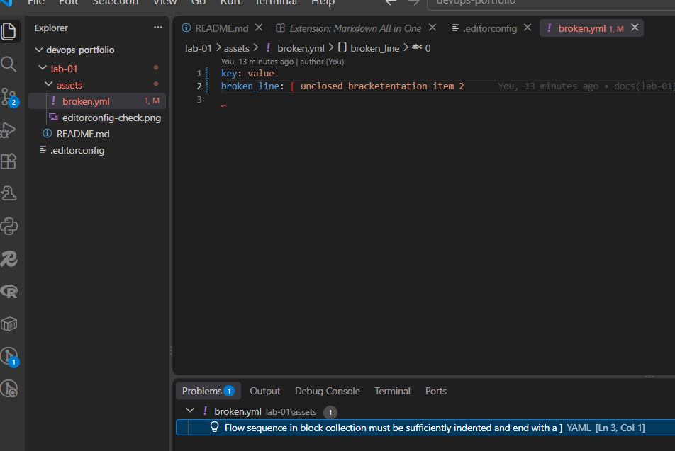
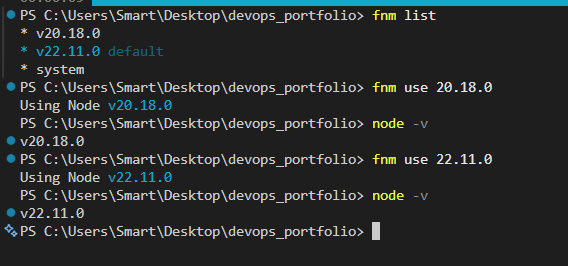

# Лабораторна робота №1 — Звіт

## Завдання 1. Git і редактор

Вивід глобальних налаштувань Git (`git config --list --global`):

```text
core.editor=code --wait
core.autocrlf=input
filter.lfs.process=git-lfs filter-process
filter.lfs.required=true
filter.lfs.clean=git-lfs clean -- %f
filter.lfs.smudge=git-lfs smudge -- %f
user.name=mila130106
user.email=yeremichukk@gmail.com
http.postbuffer=524288000
init.defaultBranch=main
pull.rebase=true

Чому значення core.autocrlf різне для Windows і Unix, і що станеться в команді зі змішаними системами, якщо його не задати?
Операційні системи використовують різні символи для завершення рядка у текстових файлах: Windows використовує комбінацію символів CRLF (Carriage Return + Line Feed), тоді як Unix-подібні системи (Linux, macOS) використовують тільки LF.

Для Windows зазвичай задають true (або input), щоб Git автоматично конвертував CRLF у LF під час коміту і назад під час витягування коду. Для Linux/macOS встановлюють input.

Якщо не налаштувати цей параметр у команді зі змішаними ОС, кожен розробник на Windows буде автоматично «переписувати» кінці рядків у файлах на свої під час коміту. Через це історія Git буде заповнена нескінченними змінами у файлах, де «змінився кожен рядок», хоча реального коду ніхто не чіпав. Це призведе до серйозних конфліктів злиття (merge conflicts).

Чим історія з pull.rebase=true відрізняється від типової?

Типова поведінка (pull.rebase=false або merge): Коли ви робите git pull і в репозиторії з'явилися нові коміти, Git створює додатковий технічний «коміт злиття» (merge commit), який часто псує історію і робить її гіллястою та важкою для читання (git log).

З pull.rebase=true: Git тимчасово знімає ваші локальні коміти, оновлює вашу гілку останніми змінами з віддаленого репозиторію, а потім «накладає» ваші коміти поверх них у лінійному порядку. Історія залишається ідеально рівною, лінійною, без зайвих комітів об'єднання, ніби ви писали весь код послідовно однією лінією.

## Завдання 1. Налаштування `.editorconfig`

Файл `.editorconfig` у корені репозиторію для підтримання єдиного стилю форматування коду та відступів. Також було встановлено розширення для редактора та перевірено роботу правил на зламаному YAML-файлі.

### Скріншот перевірки EditorConfig:


### Завдання 2. Встановлення Node.js через менеджер версій (fnm)

Для керування версіями Node.js було встановлено сучасний менеджер **fnm** (Fast Node Manager). Успішно встановлено та перевірено роботу з версіями `v20.18.0` та `v22.11.0`.


*Рисунок 1 — Перевірка списку версій та перемикання між Node.js v20.18.0 і v22.11.0 за допомогою fnm*
