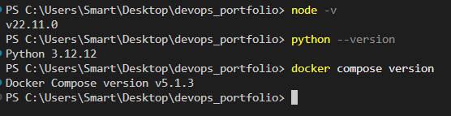

# Лабораторна робота №1 — Звіт

## Завдання 1. Git і редактор

Вивід глобальних налаштувань Git (`git config --list --global`):

```text
core.editor=code --wait
core.autocrlf=input
filter.lfs.process=git-lfs filter-process
filter.lfs.required=true
filter.lfs.clean=git-lfs clean -- %f
filter.lfs.smudge=git-lfs smudge -- %f
user.name=mila130106
user.email=yeremichukk@gmail.com
http.postbuffer=524288000
init.defaultBranch=main
pull.rebase=true1.

1. Чому значення core.autocrlf різне для Windows і Unix, і що станеться в команді зі змішаними системами, якщо його не задати?

Операційні системи використовують різні символи для закінчення рядка (CRLF у Windows і LF у Unix/macOS). Якщо цей параметр не налаштувати у проєкті, де працюють розробники з різними ОС, Git почне автоматично перезаписувати кінці рядків при кожному коміті, через що історія заповниться хибними змінами.

2. Чим історія з pull.rebase=true відрізняється від типової?

Звичайна поведінка (merge) при отриманні змін створює зайвий коміт злиття, якщо є розбіжності. Режим rebase=true тимчасово прибирає твої локальні коміти, оновлює гілку з репозиторію, а потім акуратно накладає твої коміти зверху, роблячи історію абсолютно рівною та лінійною.

Завдання 1 (продовження). Налаштування .editorconfig
Файл .editorconfig у коріні репозиторію слугує для підтримки єдиного стилю форматування коду.
Перевірка EditorConfig (підсвічування навмисно зламаного YAML):


Завдання 2. Встановлення Node.js через менеджер версій (fnm)
Для керування версіями Node.js було встановлено менеджер fnm. Успішно перевірено роботу з версіями v20.18.0 та v22.11.0.
Перемикання між двома версіями Node.js на одній машині:


fnm-switch.png

---

## Завдання 2. Середовища виконання

### Письмова відповідь:
**Навіщо менеджер версій, коли проєктів більшеone (більше одного)?**
Різні проєкти часто залежать від конкретних версій середовищ (наприклад, легаси-проєкт вимагає Node.js v18, а новий — v22). Менеджер версій дозволяє ізольовано та швидко перемикатися між ними на рівні системи чи робочої директорії без конфліктів і необхідності постійно перевстановлювати пакети глобально.

### Вивід версій усіх інструментів:
**Перевірка версій Node.js, Python та Docker Compose:**


Чому приватний ключ ніколи не потрапляє в репозиторій і що робити, якщо він туди потрапив?

Приватний ключ є секретною криптографічною інформацією і служить для підтвердження особи власника. Якщо він потрапить до сторонніх осіб, вони зможуть отримати повний доступ від твого імені до всіх твоїх репозиторіїв та сервісів на GitHub. Тому його категорично заборонено передавати чи комітити у систему контролю версій.

Послідовність дій, якщо приватний ключ випадково потрапив у репозиторій:

Негайно видалити компрометований ключ зі свого комп'ютера та зловмисного репозиторію (зробити новий коміт або видалити файл).

Зайти на GitHub у налаштування SSH-ключів (Settings -> SSH and GPG keys) і терміново видалити цей публічний ключ, щоб заблокувати доступ через нього.

Згенерувати нову пару SSH-ключів із надійною парольною фразою за допомогою команди ssh-keygen.

Додати новий публічний ключ у свій профіль на GitHub.

Перевірити історію комітів репозиторію (а за потреби й повністю переписати історію через git filter-branch або BFG Repo-Cleaner), оскільки залишки ключа можуть залишитися в кеші комітів Git.
